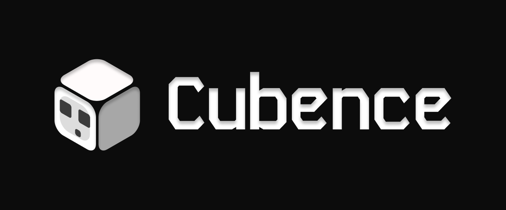
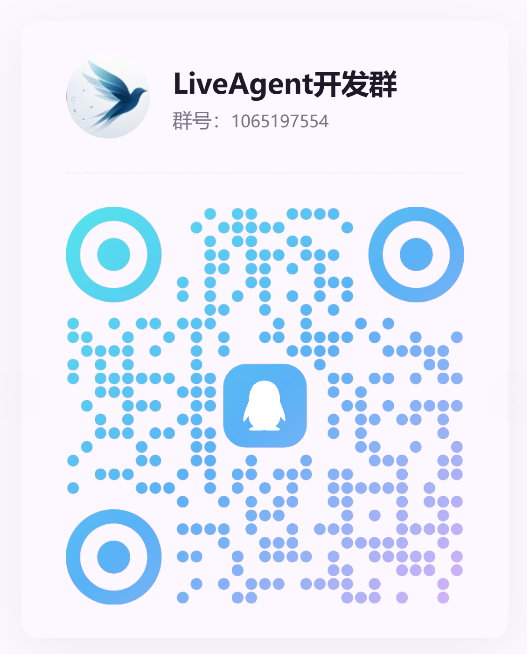
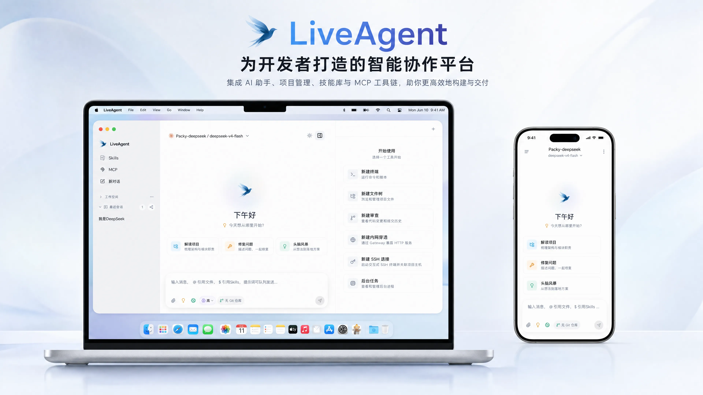
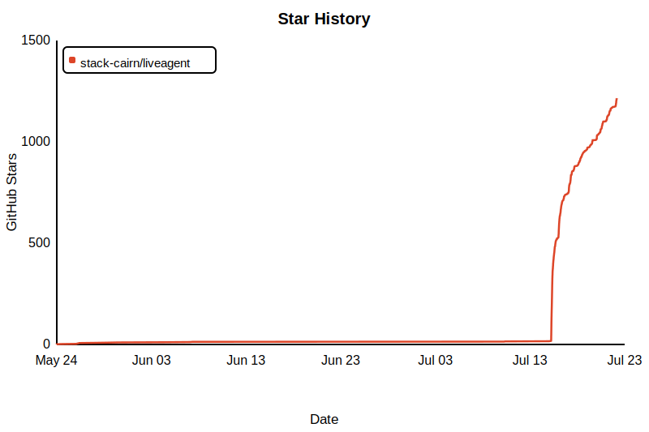

<p align="center">
  
</p>

<h1 align="center">ZeroAgent</h1>

<p align="center">
  <strong>USA-零专属本地 AI Agent 终端</strong><br/>
  账户登录 · 密钥自动绑定 · 本地工具执行 · 桌面与 WebUI
</p>

<p align="center">
  <a href="README.md">English</a> | 简体中文
</p>

<p align="center">
  
  
  
  
  
  
</p>

<p align="center">
  <a href="#核心能力">核心能力</a> •
  <a href="#下载与部署">下载与部署</a> •
  <a href="#faq">FAQ</a> •
  <a href="docs/">文档</a>
</p>

---

## 🌟 特别鸣谢

<p align="center">
  <a href="https://linux.do">
    
  </a>
</p>
<p align="center"><b>学AI，上L站！祝小破站越来越好～</b></p>

---

## ❤️ 赞助商

<table>
<tr>
<td width="200" align="center" valign="middle"><a href="https://www.packyapi.com/register"></a></td>
<td valign="middle">PackyCode 是一家稳定、高效、专业的API中转服务商，提供 Claude Code、Codex、Gemini，国模 等多种中转服务，老牌顶级中转，<b>开发本软件用的绝大多数模型资源都是PackyCode提供，感谢老农！</b>从 <a href="https://www.packyapi.com/register">此处</a> 注册并开始使用！ </td>
</tr>
<tr>
<td width="200" align="center" valign="middle"><a href="https://www.right.codes/register"></a></td>
<td valign="middle">Right Code 提供稳定的 Claude Code、Codex、Gemini，国模 等模型的中转服务。充值即可开票，企业、团队用户一对一对接。<b>开发本软件用的另一部分模型资源都是RightCode提供，感谢RC站长，感谢小客服！</b> 从 <a href="https://www.right.codes/register">此处</a> 注册并开始使用！</td>
</tr>
<tr>
<td width="200" align="center" valign="middle"><a href="https://cubence.com/signup"></a></td>
<td valign="middle">Cubence 是一家可靠高效的 API 中转服务商，提供 Claude Code、Codex、Gemini 等多种模型的中转服务，支持按量付费的计费方式。<b>感谢 Cubence 对本项目的支持！</b>从 <a href="https://cubence.com/signup">此处</a> 注册并开始使用！</td>
</tr>
</table>


---

## 🤝 一起来开发吧！

<p align="center">
  
</p>

<p align="center">
  欢迎扫码进群，一起推进 ZeroAgent 的开发！<br/>
  （至于为什么是QQ群，感觉功能比微信群多一些～）
</p>


---

## 为什么是 ZeroAgent?

ZeroAgent 是一个绑定 **USA-零** 服务的本地优先 AI Agent 客户端。账户、分组和 API Key 由 USA-零统一管理，客户端不允许连接任意第三方 Provider 地址。

- USA-零后端支持运行时配置（桌面登录页或 `VITE_USA_ZERO_ORIGIN`；Gateway 使用 `USA_ZERO_ORIGIN`）
- 登录后自动同步可用分组与模型；无 Key 时引导多选分组并快速创建
- 密钥默认隐藏，复制前必须再次验证 USA-零 账户密码

- **真正动手的 Agent** — 不止于对话:读写文件、精确编辑、执行 Bash、托管长驻进程
- **生态完全开放** — MCP 协议桥接任意外部工具,Skills 技能包按需加载
- **本地与远程兼得** — 桌面端独立可用,部署 Gateway 后浏览器随处操控

---

## 核心能力



### 🧠 多模型与对话

- **多模型路由** — 通过 USA-零 分组使用 Claude、Codex 与 Gemini 协议，服务地址固定且不可改为第三方地址
- **富文本渲染** — Markdown 流式渲染,内建 KaTeX 公式、Mermaid 图表与 Monaco 代码预览
- **历史压缩** — Segment + Summary Checkpoint 双层持久化,长对话不丢上下文
- **国际化** — 内建 i18n 多语言框架

### 🔧 本地工具执行

- **文件系统全能力** — `Read` / `Write` / `Edit` / `Delete` 精确读写,`Glob` / `Grep` 模式与正则搜索
- **Bash 与长驻进程** — 非交互式命令执行(cwd / timeout),`ManagedProcess` 托管 dev server 等常驻任务
- **Sub-Agent 委派** — 独立子代理并行执行,worktree 隔离,自动合并
- **隧道暴露** — `TunnelManager` 一键将本地服务暴露公网

### 🧩 MCP 与 Skills 生态

- **MCP 协议桥接** — Tauri 端原生桥接任意 stdio / http MCP Server,无限扩展工具能力
- **Skills 技能包** — 渐进式披露、按需加载,支持安装 / 创建 / 打包与 ClawHub 生态

### 💾 记忆与自动化

- **持久化记忆** — Markdown + SQLite FTS 全文检索,跨会话知识管理
- **定时任务** — bash / http / prompt 三种 Cron 任务类型,后台自动执行

### 🌐 远程 Gateway

- **浏览器随处访问** — Go 网关(WebSocket + Protobuf),WebUI 远程操控本地 Agent
- **断线可恢复** — 有界 seq window 补齐短时断线,桌面端持久化兜底

---

## 下载与部署

安装包由 GitHub Actions 自动构建并发布,请前往 [**GitHub Releases**](https://github.com/tkxs/ZeroAgent/releases/latest) 获取最新版本。

### 系统要求

| 平台 | 要求 |
|---|---|
| macOS | Intel(x64)与 Apple Silicon(aarch64)双架构 |
| Windows | x64,需 WebView2 运行时(Windows 11 已内置) |
| Linux | x86_64,需 WebKitGTK 4.1(Ubuntu 22.04+ / Debian 12+ 等) |

### macOS 用户

从 [Releases](https://github.com/tkxs/ZeroAgent/releases/latest) 下载对应芯片的 DMG,打开后将 ZeroAgent 拖入「应用程序」:

- Apple Silicon(M 系列):`ZeroAgent-<版本>-macOS-aarch64.dmg`
- Intel:`ZeroAgent-<版本>-macOS-x64.dmg`

> 安装包已签名并通过 Apple 公证,首次启动无需在安全设置中手动放行。

### Windows 用户

从 [Releases](https://github.com/tkxs/ZeroAgent/releases/latest) 按需选择一种安装方式:

| 方式 | 文件 | 适合 |
|---|---|---|
| 安装向导 | `ZeroAgent-<版本>-Windows-x64-Setup.exe` | 大多数用户 |
| MSI 包 | `ZeroAgent-<版本>-Windows-x64.msi` | 企业分发 / 静默安装 |
| 便携版 | `ZeroAgent-<版本>-Windows-x64-portable.zip` | 免安装,解压即用 |

### Linux 用户

从 [Releases](https://github.com/tkxs/ZeroAgent/releases/latest) 按发行版选择:

| 格式 | 适用发行版 | 安装方式 |
|---|---|---|
| AppImage | 任意发行版 | `chmod +x` 后直接运行 |
| DEB | Debian / Ubuntu 系 | `sudo dpkg -i ZeroAgent-<版本>-Linux-x86_64.deb` |
| RPM | Fedora / openSUSE 系 | `sudo rpm -i ZeroAgent-<版本>-Linux-x86_64.rpm` |

### Android（arm64）

从 [Releases](https://github.com/tkxs/ZeroAgent/releases/latest) 下载 `ZeroAgent-<版本>-Android-arm64.apk`，并在 Android 提示时允许浏览器或文件管理器安装未知来源应用。

Android 版本是 ZeroAgent Gateway WebUI 的轻量网页壳。启动后请输入已部署 Gateway 的 HTTPS 地址。如需在模拟器或 USB 连接的设备上测试本机 `3001` 端口的 Gateway，请先启用端口反向转发，再在应用中填写 `http://127.0.0.1:3001`：

```bash
adb reverse tcp:3001 tcp:3001
```

### 需要远程访问? 部署 Gateway

桌面端直接连接登录页中配置的 USA-零地址。需要网页云端对话，或从网页/桌面控制其他已注册设备时，再部署 Gateway。

**注意：在部署并使用Nginx反向代理后，设置中Remote页面Gateway地址填写Https地址，端口号填写443。**

```bash
# 拉取镜像(GitHub Actions 自动构建,multi-arch: amd64 / arm64)
docker pull ghcr.io/tkxs/zeroagent-gateway:latest

# 后台运行(HTTP/WebSocket → 宿主机 3000)
docker run -d \
  --name zeroagent-gateway \
  --restart unless-stopped \
  -p 3000:8080 \
  -e LIVEAGENT_GATEWAY_OPERATOR_TOKEN=your-operator-token \
  -e USA_ZERO_ORIGIN=https://usa0.top \
  ghcr.io/tkxs/zeroagent-gateway:latest
```

**一键升级到最新版** — 拉取新镜像 → 删除旧容器 → 以相同参数重建(若你修改过端口映射或 token,请同步替换下方参数):

```bash
docker pull ghcr.io/tkxs/zeroagent-gateway:latest \
  && docker rm -f zeroagent-gateway \
  && docker run -d \
    --name zeroagent-gateway \
    --restart unless-stopped \
    -p 3000:8080 \
    -e LIVEAGENT_GATEWAY_OPERATOR_TOKEN=your-operator-token \
    -e USA_ZERO_ORIGIN=https://usa0.top \
    ghcr.io/tkxs/zeroagent-gateway:latest \
  && docker image prune -f
```

<details>
<summary><b>Nginx 反向代理配置</b> — 自建域名 / TLS 时参考</summary>

> 自 v2 协议起,WebUI、HTTP API 以及浏览器端和桌面端的 WebSocket 链路全部走同一个 HTTP 端口(默认 3000)。
>
> WebSocket 升级发生在多个路径上(`/ws/v2`、`/ws/v2/agent`、`/ws/v2/terminal`,以及 `/t/` 下的隧道),最省事且正确的做法是在整个 vhost 上启用升级:

```nginx
# WebUI SPA/静态资源/API + 全部 WebSocket 链路(浏览器端与桌面端)
location / {
    proxy_pass http://127.0.0.1:3000;
    proxy_http_version 1.1;

    # WebSocket 升级
    proxy_set_header Upgrade $http_upgrade;
    proxy_set_header Connection "upgrade";

    # 必须透传:Gateway 的同源校验会拿浏览器的 Origin 头
    # 与 X-Forwarded-Proto + Host 做比对
    proxy_set_header Host $host;
    proxy_set_header Authorization $http_authorization;
    proxy_set_header X-Forwarded-For $proxy_add_x_forwarded_for;
    proxy_set_header X-Forwarded-Proto $scheme;

    # Gateway 每 15s 主动向每条 WebSocket 连接发 Ping,超时给足冗余即可
    proxy_read_timeout 300s;
    proxy_send_timeout 300s;
    proxy_buffering off;
}
```

> 上游端口与上方 `docker run` 的宿主机映射对应:HTTP/WebSocket 3000(容器内 HTTP 实际监听 `PORT=8080`)。server 块需要 `listen 443 ssl;`,并把 `client_max_body_size` 调大到足够容纳附件上传(如 `100m`)。

</details>


### 从源码构建

前置条件：Node.js 22、pnpm 10、Rust stable、Go 1.25 和 `protoc`。USA-零默认后端地址为 `https://usa0.top`；本地开发时仍可通过登录页或环境变量覆盖。

```powershell
cd crates/agent-gui
pnpm install
pnpm tauri dev
```

桌面开发页面由 Tauri 加载 `http://localhost:2120`。本地启动 Gateway 时设置 `PORT=3001` 和 `USA_ZERO_ORIGIN=https://usa0.top`，然后访问 ZeroAgent WebUI：`http://127.0.0.1:3001`。浏览器账户请求通过 Gateway BFF 和 HttpOnly 会话 Cookie 完成。

展开下方「开发指南」查看完整 Make 命令。


<details>
<summary><b>架构总览</b> — 架构图与技术栈</summary>

```
┌──────────────────────────────────────────────────────────────┐
│                        Browser WebUI                          │
│              React + Vite + WebSocket + Gateway API           │
└────────────────────────────┬─────────────────────────────────┘
                             │ WebSocket / HTTP
┌────────────────────────────▼─────────────────────────────────┐
│                       Agent Gateway                           │
│    Go · WebSocket · HTTP · Session Manager · Event Store     │
│                    (Railway / Docker / 自部署)                 │
└────────────────────────────┬─────────────────────────────────┘
                             │ WebSocket v2 (双向流)
┌────────────────────────────▼─────────────────────────────────┐
│                        Agent GUI                              │
│                   Tauri 2 · React 19 · Rust                  │
├──────────┬───────────┬───────────┬───────────┬───────────────┤
│ 模型协议  │ Agent运行时 │  工具执行   │  Skills   │  Memory/Cron  │
│ pi-ai    │ 多轮循环   │ FS/Bash/  │  渐进披露  │  SQLite+MD    │
│ + Codex  │ + SubAgent │ MCP桥接   │  + Hub    │  FTS索引      │
└──────────┴───────────┴───────────┴───────────┴───────────────┘
```

**技术栈**

| 组件 | 技术 |
|---|---|
| **Agent GUI** · 框架 | Tauri 2 + React 19 + TypeScript 6 |
| **Agent GUI** · 构建 | Vite 8 + pnpm |
| **Agent GUI** · 样式 | Tailwind CSS 4 + Radix UI |
| **Agent GUI** · 渲染 | streamdown + KaTeX + Mermaid + Monaco Editor |
| **Agent GUI** · 后端 | Rust + Tokio + SQLite (rusqlite) + WebSocket (tokio-tungstenite) |
| **Agent GUI** · LLM | @earendil-works/pi-ai · @openai/codex-sdk · claude-agent-sdk |
| **Gateway** · 语言 | Go 1.25 |
| **Gateway** · 协议 | WebSocket + Protobuf + HTTP |
| **Gateway** · Web UI | React + Vite + Tailwind CSS(嵌入式) |
| **Gateway** · 部署 | Docker multi-stage · Railway CI/CD |

</details>

<details>
<summary><b>开发指南</b> — 常用 Make 命令(完整列表见 <code>make help</code>)</summary>

| 命令 | 说明 |
|---|---|
| `make dev` | 启动 Tauri 开发环境 |
| `make build` | 构建桌面应用 |
| `make dev-gateway` | 启动 Gateway 开发服务 |
| `make dev-webui` | 启动 WebUI 开发服务 |
| `make gateway-build` | 构建 Gateway 二进制 |
| `make gateway-docker-build` | 构建 Docker 镜像 |
| `make gateway-docker-smoke` | 构建 + 健康检查 |
| `make desktop-build-macos-release` | macOS 签名发布构建 |
| `make build-linux` | Linux amd64 网关 |
| `make build-linux-arm` | Linux arm64 网关 |
| `make proto` | 重新生成 Protobuf 代码 |
| `make clean` | 清理构建产物 |

</details>

<details>
<summary><b>项目结构</b> — 目录树</summary>

```
ZeroAgent/
├── crates/
│   ├── agent-gui/                # 桌面客户端
│   │   ├── src/                  # React 前端
│   │   │   ├── components/       #   UI 组件
│   │   │   ├── lib/              #   核心逻辑 (chat, tools, skills, memory)
│   │   │   ├── pages/            #   页面 (Chat, Settings)
│   │   │   ├── i18n/             #   国际化
│   │   │   └── prompt/           #   System Prompt 模板
│   │   └── src-tauri/            # Rust 后端 (Tauri)
│   │
│   └── agent-gateway/            # Go 网关服务
│       ├── cmd/gateway/          #   入口
│       ├── internal/             #   核心实现
│       ├── proto/v1/             #   Protobuf 定义
│       └── web/                  #   嵌入式 WebUI
│
├── docs/                         # 项目文档
│   ├── architecture/             #   架构设计
│   ├── features/                 #   功能说明
│   └── operations/               #   运维部署
│
├── scripts/release/              # 发布自动化
├── .github/workflows/            # CI/CD (CI + Desktop Release + Gateway Docker)
├── Dockerfile                    # Gateway 容器镜像
├── Makefile                      # 构建命令集
└── Cargo.toml                    # Rust workspace
```

</details>

---

## FAQ

<details>
<summary><b>API Key 会离开本机吗?</b></summary>

Provider 密钥通过现有设置同步回传桌面端；浏览器本地持久化内容会自动脱敏。Gateway 只代理到运行时配置的 USA-零地址，不接受用户为单次请求指定任意上游地址。

</details>

<details>
<summary><b>必须部署 Gateway 吗?</b></summary>

仅在桌面端使用本机 Agent 时不需要 Gateway。使用 WebUI 云端对话、账号设备发现或远程执行时需要 Gateway；桌面端和 Gateway 都可以连接已部署的 USA-零服务。

</details>

<details>
<summary><b>支持哪些模型?</b></summary>

通过 USA-零 的可用分组支持 Claude、Codex 和 Gemini 协议，不接受第三方 Base URL。

</details>

<details>
<summary><b>长对话 / 断线后上下文会丢吗?</b></summary>

不会。桌面端以 Segment + Summary Checkpoint 持久化完整历史;Gateway 通过有界 seq window 补齐短时断线,重连后自动收敛。

</details>

---

## 贡献

欢迎提交 Issue 与 Pull Request!开发环境搭建请参考 [开发指南](docs/operations/development.md)。

提交 PR 前,请确保以下检查全部通过(与 CI 门禁一致):

**桌面客户端 · `crates/agent-gui`**

1. 类型检查与构建通过:`pnpm build`
2. 代码规范检查通过:`pnpm lint`
3. 前端单元测试通过:`pnpm test:frontend`(改动发布脚本时另跑 `pnpm test:release`)
4. Rust 后端检查通过:`cargo check --manifest-path crates/agent-gui/src-tauri/Cargo.toml --tests`(仓库根目录执行)

**Gateway · `crates/agent-gateway`(如有改动)**

1. Go 单元测试通过:`go test ./...`
2. WebUI 构建 / Lint / 测试通过:`pnpm build && pnpm lint && pnpm test`(在 `web/` 目录执行)
3. Proto 变更后重新生成并提交产物:`make proto`

**跨端一致性**

- GUI 与 WebUI 的镜像文件必须逐字节一致:`node scripts/check-mirror.mjs`
- 保持 diff 干净 (无行尾空白):`git diff --check`

---

## 👥 贡献者

感谢所有为 ZeroAgent 做出贡献的朋友们！

<a href="https://github.com/tkxs/ZeroAgent/graphs/contributors">
  
</a>

---

## Star History

<a href="https://www.star-history.com/?repos=tkxs%2FZeroAgent&type=date&legend=top-left">

 <picture>
   <source media="(prefers-color-scheme: dark)" srcset="docs/images/star-history-dark.svg" />
   <source media="(prefers-color-scheme: light)" srcset="docs/images/star-history-light.svg" />
   
 </picture>
</a>

---

## License

MIT © StackCairn
